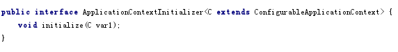
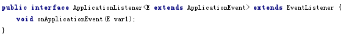
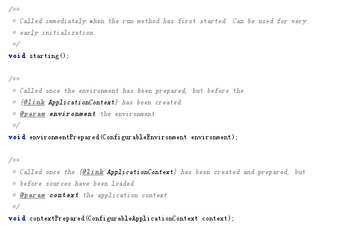
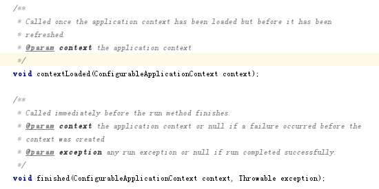
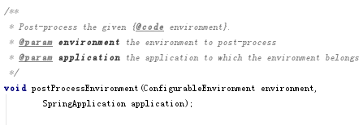
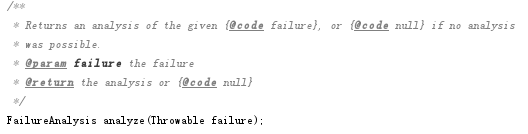

依靠SpringFactoriesLoader类，从指定的配置文件META-INF/spring.factories加载配置，实现springboot自动化配置的功能。

# 1.ApplicationContextInitializer

用于初始化ConfigurableApplicationContext的接口类

- 创建：SpringApplication初始化时调用SpringFactoriesLoader读取spring.factories配置文件中“org.springframework.context.ApplicationContextInitializer”项信息，存储于initializers属性中

- 接口解析：

initialize：

调用：SpringApplication.run->

 SpringApplication.prepareContext->

 SpringApplication.applyInitializers

 在SpringApplication运行时准备Context阶段调用

# 2.ApplicationListener

观察者模式的监听器接口，用于监听各种ApplicationEvent。

- 创建：

SpringApplication初始化时调用SpringFactoriesLoader读取spring.factories配置文	

       件中“org.springframework.context.ApplicationListener”项信息，存储于listeners属性中

ConfigurableApplicationContext在运行过程中解析到监听器时将加入到

        applicationListeners属性中

- 接口解析：

onApplicationEvent：

调用：等待EventPublishingRunListener的广播通知事件

   等待ConfigurableApplicationContext的广播通知事件

ps：监听器无差别接收所有注册过的广播发来的信息，在onApplicationEvent中需要自行过滤只处理有效的信息

# 3.SpringApplicationRunListener

监听器用于监听ConfigurableApplicationContext加载，在加载的不同阶段完成特定的目标。

其实现类EventPublishingRunListener主要用于监听ConfigurableApplicationContext加载过程，并将每个阶段封装事件通知给已注册的ApplicationListener

- 创建：SpringApplication.run->SpringApplication.getRunListeners时调用SpringFactoriesLoader读取spring.factories配置文的“org.springframework.boot.SpringApplicationRunListener”项信息，创建局部变量SpringApplicationRunListeners listeners保存于方法中

- 接口解析：

starting：

environmentPrepared：

contextPrepared：

contextLoaded：

finished：

调用：SpringApplication.run方法中根据ConfigurableApplicationContext加载的各个阶

           段		

           调用相应的方法

# 4.EnvironmentPostProcessor

环境后置处理器，在完成环境准备后调用加载用户的私有配置文件。

- 创建：SpringApplication.run->

    	      SpringApplication.prepareEnvironment->

       listeners.environmentPrepared->

       ConfigFileApplicationListener.onApplicationEnvironmentPreparedEvent调用

       SpringFactoriesLoader读取spring.factories配置文件中

       的“org.springframework.boot.env.EnvironmentPostProcessor”项信息，存储于	

       局部变量List<EnvironmentPostProcessor> postProcessors中，值得注意

      ConfigFileApplicationListener本身也实现了EnvironmentPostProcessor接口

     ，主要用于读取用户配置文件application.properties

- 接口解析：

postProcessEnvironment

调用：ConfigFileApplicationListener.onApplicationEnvironmentPreparedEvent创建后立即调用

# 5.FailureAnalyzer

异常分析器，分析异常

- 创建：SpringApplication.run->

    	      FailureAnalyzers.loadFailureAnalyzers调用

       SpringFactoriesLoader读取spring.factories配置文件中

       的“org.springframework.boot.diagnostics.FailureAnalyzer”项信息，存储于	

       FailureAnalyzers.analyzers中

- 接口解析：

analyze

调用：SpringApplication.run发生异常后经由FailureAnalyzers.analyzeAndReport()

# 6.EnableAutoConfiguration

插件的自动配置文件

创建：SpringApplication.run->

    	   AbstractApplicationContext.refreshContext->

           PostProcessorRegistrationDelegate.invokeBeanFactoryPostProcessors->

           ConfigurationClassPostProcessor.postProcessBeanDefinitionRegistry->

           ConfigurationClassParser.parse->

    ConfigurationClassParser.processDeferredImportSelectors->

    AutoConfigurationImportSelector.selectImports调用

    SpringFactoriesLoader读取spring.factories配置文件中

    的“org.springframework.boot.autoconfigure.EnableAutoConfiguration”项信息，存储于	

    局部变量中

# 7.AutoConfigurationImportFilter

过滤掉不需要的org.springframework.boot.autoconfigure.EnableAutoConfiguration默认配置项

创建：SpringApplication.run->

          AbstractApplicationContext.refreshContext->

          PostProcessorRegistrationDelegate.invokeBeanFactoryPostProcessors->

          ConfigurationClassPostProcessor.postProcessBeanDefinitionRegistry->

          ConfigurationClassParser.parse->

   ConfigurationClassParser.processDeferredImportSelectors->

   AutoConfigurationImportSelector.selectImports->

   AutoConfigurationImportSelector.filter中调用

   SpringFactoriesLoader读取spring.factories配置文件中

    的“org.springframework.boot.autoconfigure.AutoConfigurationImportListener”项信息，  

    存储于局部变量中

调用：创建后立即调用

# 8.AutoConfigurationImportListener

自动配置文件引入监听器

创建：SpringApplication.run->

          AbstractApplicationContext.refreshContext->

          PostProcessorRegistrationDelegate.invokeBeanFactoryPostProcessors->

          ConfigurationClassPostProcessor.postProcessBeanDefinitionRegistry->

          ConfigurationClassParser.parse->

   ConfigurationClassParser.processDeferredImportSelectors->

   AutoConfigurationImportSelector.selectImports->

   AutoConfigurationImportSelector.fireAutoConfigurationImportEvents中调用

   SpringFactoriesLoader读取spring.factories配置文件中

    的“org.springframework.boot.autoconfigure.AutoConfigurationImportFilter”项信息，  

    存储于局部变量中

调用：创建监听器后立即发送事件

